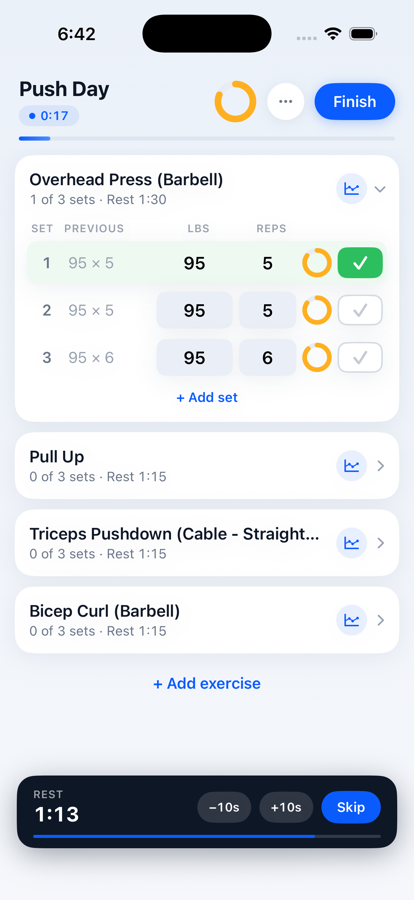
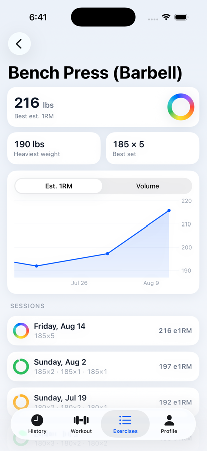
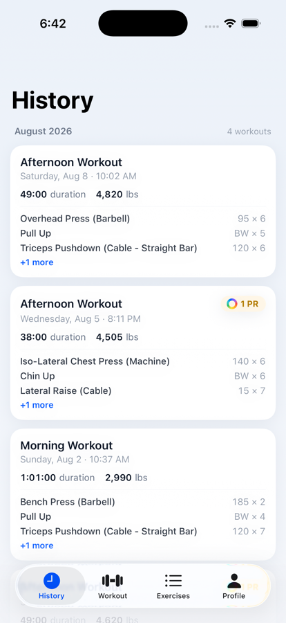
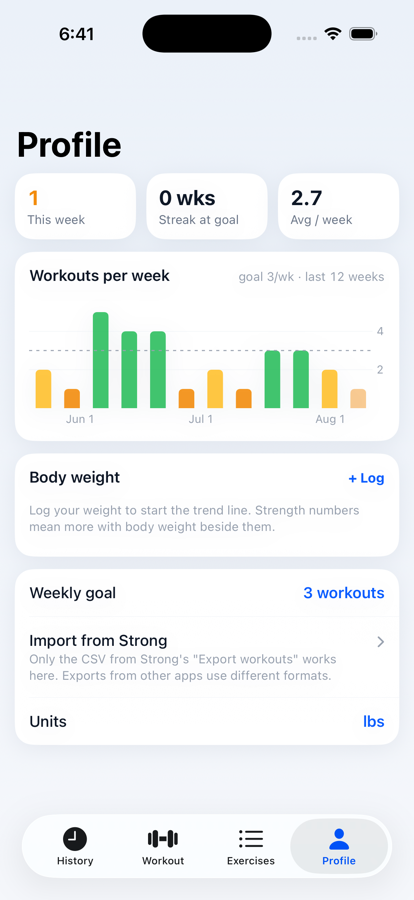

# Fitness Tracker

A native iOS strength-training log, built as a personal replacement for [Strong](https://www.strong.app) — with one signature idea: the **intensity ring**. Every set you enter is scored live against your all-time best (estimated 1RM for weighted lifts, rep records for bodyweight work) and shown as a colored ring: red when you're far from your max, yellow at working weight, green when you're pushing your limits, and an animated rainbow when the set would be a personal record.

<p align="center">
  
  
  
  
</p>

## What it does

- **Live logging** — start from a template and every set is prefilled with what you lifted last session. Check off sets to auto-start per-exercise rest timers (with notifications, ±10s nudging, and survival across app kills). A session-level ring next to Finish projects how hard the whole workout is relative to your records, updating as you edit numbers.
- **Records & charts** — per-exercise pages with best est. 1RM (Epley), heaviest weight, best set, and a progress chart you can scrub with a finger and pinch-zoom from one month out to your full history. Lines break honestly across training gaps instead of bridging them.
- **PR detection** — finishing a workout celebrates any new records; history cards carry PR chips.
- **Templates** — structure only (exercises, set counts, rest times); target numbers always come from your last real session.
- **Consistency** — Monday-based training weeks with a configurable weekly goal, goal-colored week bars, and streak tracking. Body weight logging with a trend chart.
- **Strong import** — share the CSV from Strong's "Export workouts" straight into the app (it's a registered CSV handler), or pick the file from Profile → Import. Idempotent: re-importing only adds what's new. *Only Strong's CSV format is supported.*
- **lbs / kg** — switch display units freely; storage is canonical (pounds) so history and records stay exact in both.
- Everything is offline-first: logging never touches the network. (A Supabase-backed account/backup sync exists behind a feature flag, awaiting a polish pass.)

## Status

Personal project, iPhone-only (iOS 17+), not yet on the App Store — TestFlight distribution is the next milestone. Data lives on-device in SQLite.

## Running it (developers)

Prerequisites: Xcode 26+, [XcodeGen](https://github.com/yonaskolb/XcodeGen) (`brew install xcodegen`).

```bash
git clone https://github.com/ArshaanB/fitness-tracker.git
cd fitness-tracker/App
xcodegen generate
open FitnessTracker.xcodeproj
```

In Xcode, set your own team under **Signing & Capabilities** (and change the bundle identifier — the committed one belongs to this project), pick a simulator or device, and run. The app starts empty; import a Strong CSV from the Profile tab or just log a workout.

### Project layout

| Path | What it is |
|---|---|
| `FitnessKit/` | Swift package: GRDB/SQLite schema, Strong CSV importer, records/stats/streak math. Fully unit-tested — `cd FitnessKit && swift test`. |
| `App/` | SwiftUI app (iOS 17+, Swift 6, `@Observable`, Swift Charts). `project.yml` is the source of truth; the `.xcodeproj` is generated. |
| `supabase/migrations/` | Postgres schema + row-level security for the (currently disabled) cloud backup. |
| `PRD.md`, `TECH_DESIGN.md`, `DESIGN.md` | Product requirements, technical design, and the visual design system the app follows. |
| `docs/` | Code-review reports and README screenshots. |

### Development notes

- **Storage is always pounds**; `WeightUnit`/`Format` convert at the display/entry boundary only.
- **Records are derived, never stored** — editing or deleting history recomputes everything.
- Sync uses an **outbox fed by SQLite triggers**: any local write is queued automatically, no call-site plumbing.
- DEBUG builds accept env hooks for automation (`SIMCTL_CHILD_` prefixed via `simctl launch`): `SEED_CSV=1` imports a bundled CSV on first launch, `UITAB=history|workout|exercises|profile` picks the launch tab, `OPEN_EXERCISE="Bench Press (Barbell)"` / `OPEN_WORKOUT=latest` deep-navigate, `START_WORKOUT=1` / `AUTO_FINISH=1` / `SCRUB=edge` drive flows for screenshots.
- CLI simulator builds: `xcodebuild -project FitnessTracker.xcodeproj -scheme FitnessTracker -destination 'platform=iOS Simulator,name=iPhone 17 Pro' CODE_SIGNING_ALLOWED=NO build`
